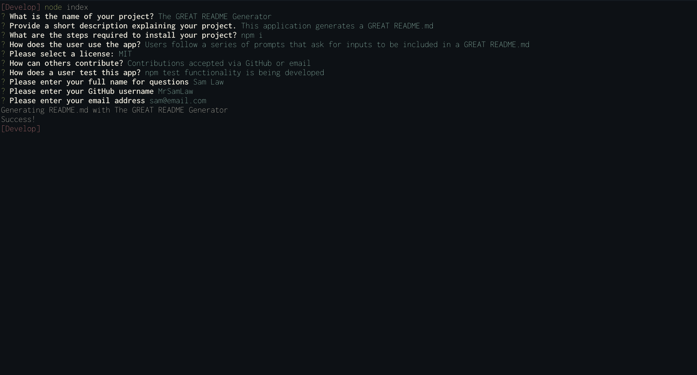

# Professional-README-Generator

Generates README.md files for a living

## Technologies
- Node.js, using Inquirer & FS packages

## Description
This application generates a README.md based on the users inputs via a series of prompts

## What We Did
Included inquirer & fs packages in node.js, filled in functions within both index.js & generateMarkdown.js.  The sample README.md is output in the output directory.